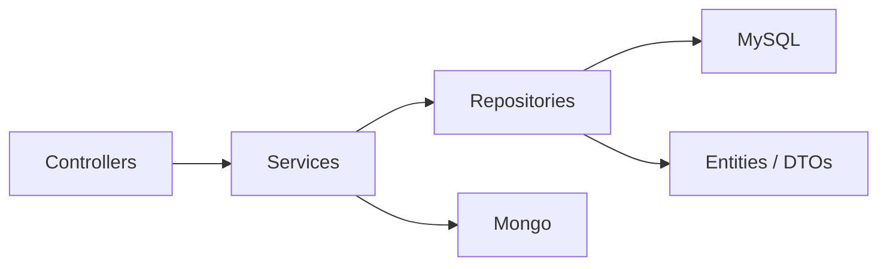

**Arquitectura — ThinWallet**

Resumen rápido
- Frontend: SPA React + TypeScript (Vite)
- Backend: Java Spring Boot (Maven)
- Persistencia: MySQL (modelo relacional) + MongoDB (auditoría/eventos)
- Comunicación: REST API (JSON)

Diagrama de alto nivel

```mermaid
flowchart TB
  Web[Browser (Vite React SPA)] -->|REST| Backend[Backend (Spring Boot)]
  Backend -->|JDBC| MySQL[(MySQL)]
  Backend -->|MongoDB Driver| Mongo[(MongoDB - Auditoría)]
  Backend -->|SMTP/Email| EmailSvc[(Email Provider)]
  classDef infra fill:#f2f2f2,stroke:#333
  class Backend,MySQL,Mongo,EmailSvc infra
```

Diagrama de componentes (Backend)



Notas técnicas
- El Backend sigue la separación `controller -> service -> repository` y usa JPA para MySQL.
- La carpeta `specs/` contiene especificaciones funcionales por feature.
- La auditoría de negocio se almacena en MongoDB usando Bucket Pattern y Approximation (ver `Basesdedatos/auditoria_mongodb_final.js`).

Recomendaciones de diseño
- Mantener `Backend/target/` ignorado por Git (ya aplicado).
- Externalizar configuración sensible con variables de entorno o `application-*.yml`.
- Añadir diagramas de secuencia por endpoint crítico en `docs/` si se requiere documentación técnica más profunda.
